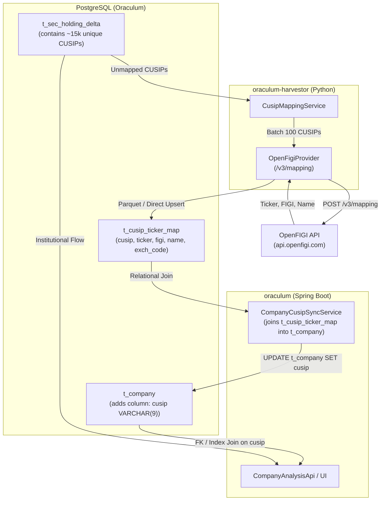

# CUSIP-to-Ticker Mapping Architecture & Implementation Plan

## 1. Context & Motivation

To seamlessly integrate **SEC Form 13F institutional holding analytics** (`t_sec_holding_delta`) into Oraculum's company analysis features and frontend dashboards, queries need to correlate institutional smart-money positions by stock ticker (e.g. `WHERE ticker = 'AMD'`).

### The Challenge
- `t_company` is keyed by `ticker` and contains `cik`, `company_name`, etc.
- `t_sec_holding` and `t_sec_holding_delta` use SEC 9-digit `cusip` identifiers.
- Official SEC mapping files (`company_tickers.json`) do **not** distribute CUSIPs due to licensing copyrights owned by CUSIP Global Services (FactSet / ABA).
- SEC 13F list files provide `CUSIP` and `ISSUER_NAME`, but lack tickers and CIKs.

### The Solution: Bloomberg OpenFIGI
**OpenFIGI** (Financial Instrument Global Identifier) is a 100% free open data standard provided by Bloomberg without subscription fees. Its `/v3/mapping` endpoint takes CUSIPs in batches of 100 and returns the exact corresponding `ticker`, `exchCode`, `name`, and security metadata.

---

## 2. Target Architecture



---

## 3. Database Schema Changes

### A. Add `cusip` to `t_company`
File: `V24__t_company_cusip.sql` (or next Flyway version)
```sql
-- 1. Add CUSIP column to t_company
ALTER TABLE t_company ADD COLUMN IF NOT EXISTS cusip VARCHAR(9);
CREATE INDEX IF NOT EXISTS ix_company_cusip ON t_company (cusip);

-- 2. Create persistent CUSIP-to-Ticker mapping dictionary
-- Stores all discovered CUSIPs across the entire 13F universe (equities, ADRs, ETFs)
CREATE TABLE IF NOT EXISTS t_cusip_ticker_map (
    cusip            VARCHAR(9) PRIMARY KEY,
    ticker           VARCHAR(30) NOT NULL,
    figi             VARCHAR(12),
    composite_figi   VARCHAR(12),
    security_type    VARCHAR(50),
    name             VARCHAR(255),
    exch_code        VARCHAR(10),
    created_at       TIMESTAMP WITH TIME ZONE DEFAULT CURRENT_TIMESTAMP,
    updated_at       TIMESTAMP WITH TIME ZONE DEFAULT CURRENT_TIMESTAMP
);

CREATE INDEX IF NOT EXISTS ix_cusip_ticker_map_ticker ON t_cusip_ticker_map (ticker);
```

---

## 4. Implementation Steps

### Step 1: OpenFIGI Client & Service in `oraculum-harvestor`
1. **Create `OpenFigiProvider`** in `harvester/providers/openfigi_provider.py`:
   - Calls `https://api.openfigi.com/v3/mapping`.
   - Chunks arbitrary lists of CUSIPs into payloads of 100 items:
     ```json
     [
       {"idType": "ID_CUSIP", "idValue": "007903107"},
       {"idType": "ID_CUSIP", "idValue": "037833100"}
     ]
     ```
   - Filters results: `exchCode == 'US'` and `securityType` in `('Common Stock', 'Depositary Receipt', 'ETP')`.
   - Supports optional `OPENFIGI_API_KEY` from settings (up to 25 req/sec with key, 5 req/min without key).

2. **Create `CusipMappingService`** in `harvester/services/cusip_mapping.py`:
   - Scans distinct unmapped CUSIPs from `t_sec_holding` (or accepts a list of CUSIPs).
   - Resolves them via `OpenFigiProvider`.
   - Writes batch output to Parquet (`us_cusip_mapping_part-000.parquet`) and publishes `DataFileReadyEvent(dataset="cusip_mapping")`.

### Step 2: Ingestion & Sync in `oraculum` (Spring Boot)
1. **Create `CusipMappingFileLoadServiceImpl`** implementing `ParquetFileLoadService`:
   - Handles `Dataset.CUSIP_MAPPING`.
   - Loads Parquet into `t_cusip_ticker_map` via `ON CONFLICT (cusip) DO UPDATE`.
2. **Synchronize with `t_company`**:
   - In `postBatchComplete` (or via scheduler similar to `SecCikSyncScheduler`):
     ```sql
     UPDATE t_company c
     SET cusip = m.cusip,
         updated_at = CURRENT_TIMESTAMP
     FROM t_cusip_ticker_map m
     WHERE c.ticker = m.ticker
       AND (c.cusip IS NULL OR c.cusip != m.cusip);
     ```

### Step 3: Fast Analytical Views & APIs
Once `t_company.cusip` is populated, link institutional delta directly:

```sql
-- Example: Get institutional positioning for any company by Ticker
SELECT 
    c.ticker,
    c.company_name,
    d.report_period,
    COUNT(DISTINCT d.cik) FILTER (WHERE d.shares_current > 0) AS tier1_holders,
    SUM(d.shares_current)                                    AS total_shares_held,
    SUM(d.shares_change)                                     AS net_shares_change,
    ROUND(SUM(d.value_usd_current) / 1000000.0, 2)           AS total_value_mil_usd,
    ROUND(SUM(d.value_usd_change) / 1000000.0, 2)            AS net_value_change_mil_usd
FROM t_company c
JOIN t_sec_holding_delta d ON d.cusip = c.cusip
WHERE c.ticker = :ticker
  AND d.option_type IS NULL
GROUP BY c.ticker, c.company_name, d.report_period
ORDER BY d.report_period DESC;
```

---

## 5. Performance & Resource Characteristics

- **Total Unique CUSIPs in 13F**: ~15,000.
- **Batch Size**: 100 CUSIPs per request.
- **Number of HTTP Requests**: ~150 requests total.
- **Execution Time**:
  - With free API key (25 req/sec): **~6 to 8 seconds**.
  - Without API key (5 req/min): Run in small chunks or register free API key.
- **Subsequent Runs**: Only newly discovered CUSIPs (~50 to 100 per quarter) need to be queried (1 single HTTP request per quarter).

---

## 6. Verification & Acceptance Criteria

1. `t_company.cusip` is populated for all major US equities (e.g. `AMD -> 007903107`, `AAPL -> 037833100`, `NVDA -> 67066G104`).
2. Foreign key or join condition between `t_company.cusip` and `t_sec_holding_delta.cusip` executes with Index Scan (< 5ms).
3. The mapping process is fully idempotent and automatically resolves any newly added tickers or holdings.
