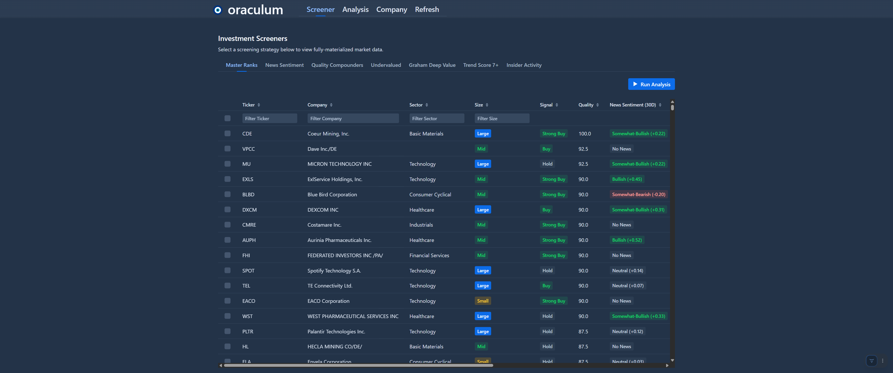
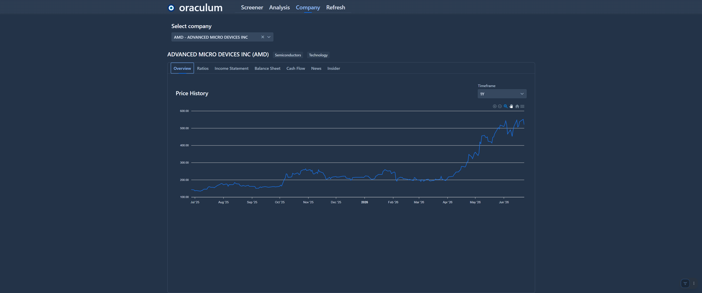
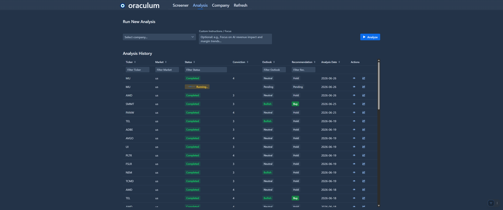
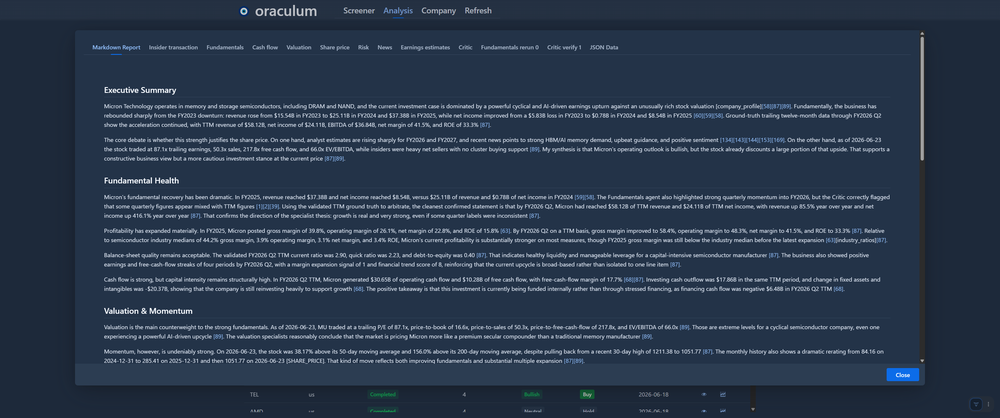
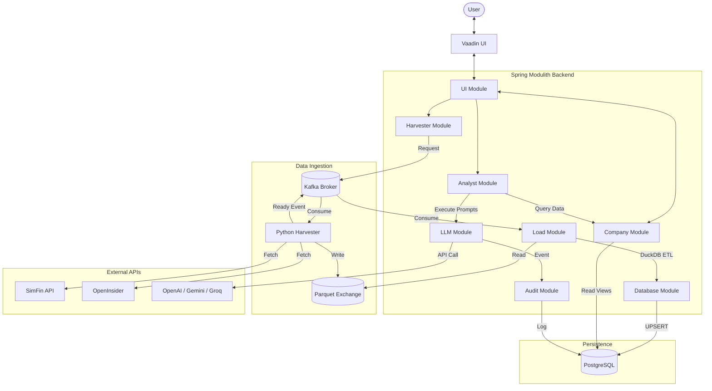

# Oraculum

An AI-powered quantitative investment analysis platform built with Spring Modulith, DuckDB, Kafka, and Vaadin. 

Oraculum acts as your personal AI stock analyst. It orchestrates a multi-agent system to synthesize fundamental financial data, technical share price signals, insider trading activity, and real-time news sentiment into comprehensive, actionable investment recommendations.

> [!NOTE]
> Oraculum was built as an advanced personal project to explore Agentic AI orchestration, high-performance data engineering, and modern Java modularity. 

---

## 📸 Screenshots & UI

* **Screener View**  
  <a href="docs/images/screener.png"></a>

* **Company Overview**  
  <a href="docs/images/company.png"></a>

* **Analysis Progress & Multi-Agent UI**  
  <a href="docs/images/analysis.png"></a>

* **Analysis Detail & AI Report**  
  <a href="docs/images/analysis_detail.png"></a>

---

## 🏗️ Architecture

Oraculum uses a decoupled, event-driven architecture powered by **Spring Modulith** on the backend and an asynchronous Python **Harvester** for data ingestion.



### Core Technologies & Engineering Highlights

1. **Spring Modulith:** Enforces strict logical boundaries between domains (`analyst`, `company`, `load`, etc.) communicating exclusively via Spring Application Events and exposed APIs. Validated by ArchUnit tests.
2. **DuckDB In-Memory ETL:** A highly optimized pipeline that reads Parquet files (generated by the Harvester) at native C++ speeds and merges them directly into PostgreSQL over the wire, entirely bypassing Java serialization bottlenecks.
3. **Advanced PostgreSQL Analytics:** Features complex materialized views calculating Piotroski F-Scores, Graham Deep Value metrics, Multi-Window Sentiment decay, and GARP screens natively in SQL. Uses table partitioning for high-volume time-series data.
4. **Resilient AI Routing:** The `LLM Module` implements circuit breakers and fallback routing (OpenAI → Gemini → Groq) via Resilience4j to ensure high availability for analysis tasks.
5. **Python Harvester:** An asynchronous FastStream microservice that connects to the SimFin SDK and OpenInsider, writing massive financial datasets to Parquet files and notifying the Java backend via Kafka.
6. **Reactive UI:** Built with Vaadin, featuring `@Push` WebSockets for real-time AI progress visualization and dynamic JSONB-driven grids for varying financial statement templates.

## 🤖 Multi-Agent AI System

Oraculum doesn't just pass numbers to an LLM; it orchestrates a team of specialized AI agents working together in a recursive workflow:

**1. The Specialists**
- 📊 **Fundamentals Agent**: Analyzes ROCE, margins, cash flows, and balance sheet health.
- 🗞️ **News Agent**: Evaluates real-time news for market sentiment and materiality.
- 🕴️ **Insider Agent**: Detects cluster buys and executive confidence signals.
- 📈 **Share Price Agent**: Analyzes technicals, moving averages, and volume velocity.

**2. The Review Loop**
- 🧐 **Critic Agent**: Reviews the raw outputs of the specialist agents for logical inconsistencies, bias, or conflicting conclusions. If it finds issues, it instructs specific specialists to re-evaluate their data, creating a powerful feedback loop.

**3. The Final Thesis**
- 🧠 **Synthesizer (Final Analyst)**: Once the Critic is satisfied, the Synthesizer compiles all the verified specialist signals to deliver a final investment thesis with a conviction score and target price.

### 🔍 Traceability & Hallucination Prevention
A major challenge with AI in finance is data hallucination. Oraculum solves this by enforcing strict **Data Provenance**. Every metric cited by an agent (e.g., `[87]`, `[39]`) is a hard-linked citation back to a specific, immutable row in the PostgreSQL database (such as a Trailing-Twelve-Month cash flow record). The Synthesizer uses these ground-truth citations to arbitrate disputes between agents, ensuring the final thesis is mathematically auditable.

## 📄 Sample Output & Agent Trace

Curious how the multi-agent system thinks and resolves data conflicts? Check out the raw outputs from a real analysis run on Micron Technology (MU):

* [Example Synthesizer Report (Markdown)](docs/samples/MU_analysis_report.md)
* [Raw Agent Trace (JSON)](docs/samples/MU_analysis_agent_trace.json) - *Shows the full state progression, Critic interventions, and ground-truth citations.*

## 🚀 Getting Started

### Prerequisites
- JDK 24+
- Node.js 22+ (for Vaadin frontend build)
- Docker Compose (for PostgreSQL and Kafka)
- Python 3.14+ and `uv` (for the Harvester)

### 1. Start Infrastructure
Run PostgreSQL and Kafka via Docker Compose:
```bash
docker-compose up -d
```

### 2. Configure Environment Variables
You will need API keys for the data providers and LLMs. Create an `.env` file or export them:
- `ORACULUM_HARVESTER_SIMFIN_API_KEY`
- `OPENAI_API_KEY` (or GEMINI/GROQ equivalents depending on your `application.yaml` config)

### 3. Start the Python Harvester
```bash
cd d:/Git/oraculum-harvestor
uv run python -m harvester
```

### 4. Run the Spring Boot Application
Due to the embedded DuckDB high-speed parquet loader, you **must** run the JVM with native access enabled:

**Using Maven:**
```bash
mvn spring-boot:run -Dspring-boot.run.jvmArguments="--enable-native-access=ALL-UNNAMED"
```

**Using the compiled JAR:**
```bash
java --enable-native-access=ALL-UNNAMED -jar target/oraculum-0.0.1-SNAPSHOT.jar
```

## 📊 Modules Overview

* **`ui`**: Vaadin-based reactive frontend with real-time analysis progress pushing via WebSockets.
* **`company`**: Core domain logic, screener strategies, and materialized view entities.
* **`analyst`**: The multi-agent LLM orchestrator.
* **`database`**: DuckDB integration and Flyway partition/maintenance management.
* **`load`**: Kafka event consumers and Parquet to Postgres ETL pipelines.
* **`harvester`**: Request publishers and API rate limit trackers.
* **`llm`**: Generic chat client wrappers with Resilience4j circuit breakers.
* **`audit`**: Asynchronous tracking of all AI tokens consumed and data loads completed.

---
*Disclaimer: Oraculum is a personal project intended for educational and analytical purposes. It does not constitute financial advice.*
