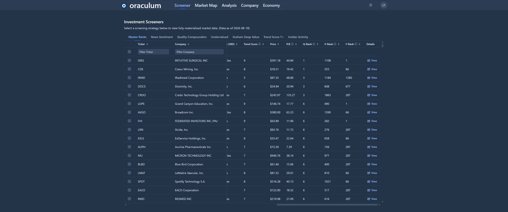
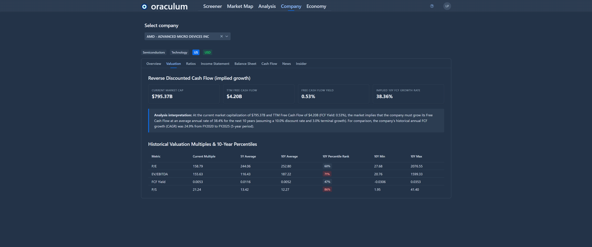
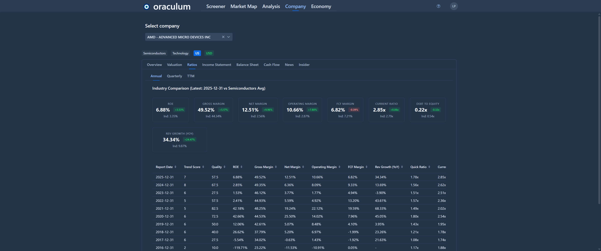
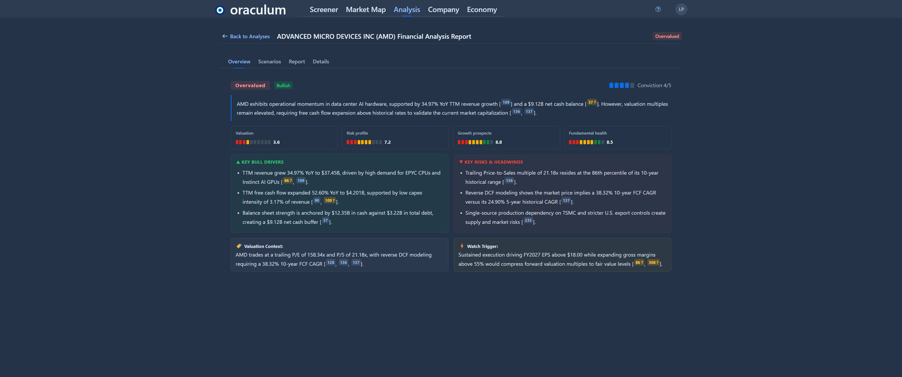
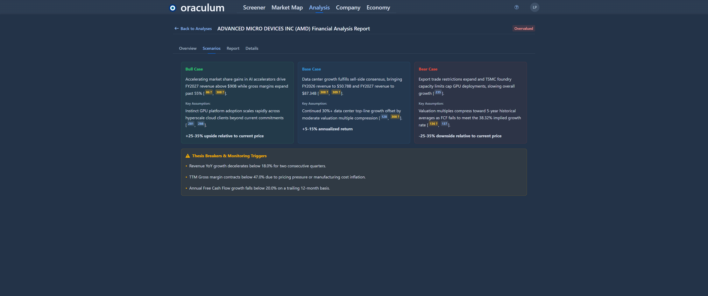
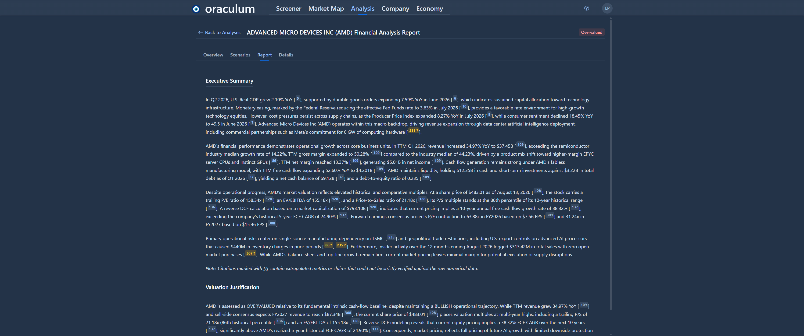
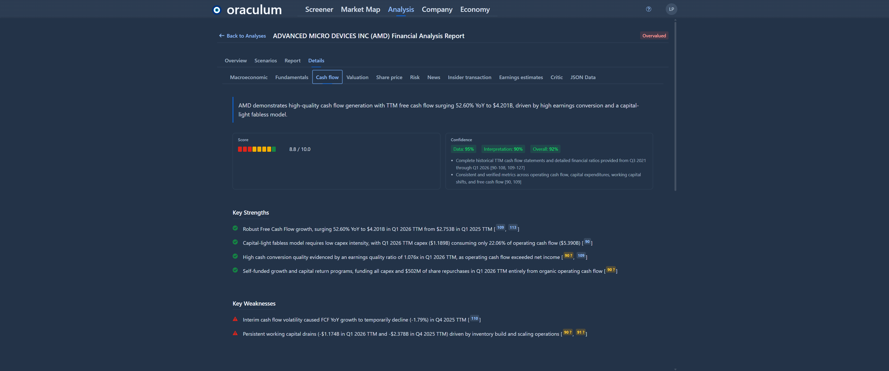
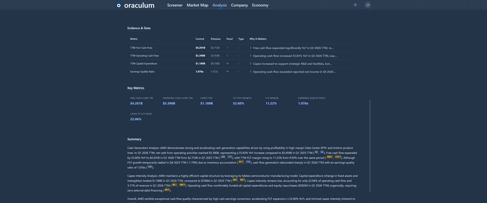
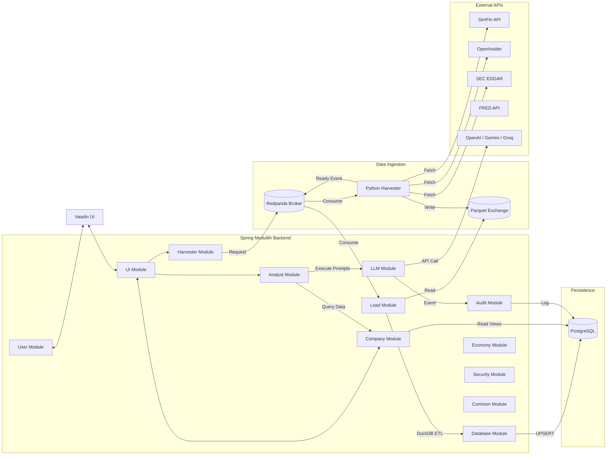

# Oraculum

An AI-powered quantitative investment analysis platform built with Spring Modulith, DuckDB, Redpanda, and Vaadin. 

Oraculum acts as your personal AI stock analyst. It orchestrates a multi-agent system to synthesize macroeconomic indicators, fundamental financial data, technical share price signals, insider trading activity, and real-time news sentiment into comprehensive, actionable investment recommendations.

> [!NOTE]
> Oraculum was built as a personal quantitative investment analysis platform to automate stock research, screen for high-conviction value opportunities, and orchestrate multi-agent AI analysis with strict financial data provenance. 

---

## ✨ Key Features

- 📊 **Quantitative Screener**: Natively screens stocks in PostgreSQL using Piotroski F-Score, Graham Deep Value (NCAV/NNWC), GARP, and Multi-Window Sentiment decay metrics.
- 🔢 **Deterministic Ground-Truth Computation**: AI agents never perform raw financial arithmetic. All fundamental ratios, technical signals, streak analytics, and Graham value metrics are computed natively via PostgreSQL Views/Materialized Views, while complex valuation models (such as Reverse DCF implied growth) run deterministically in Java before injection into agent fact sheets—minimizing hallucination risks.
- 🤖 **Recursive Multi-Agent AI Analyst**: 9 specialized AI agents, an automated Critic feedback loop, and a Synthesizer analyst working together in a structured state machine.
- 🔍 **Strict Data Provenance**: Every metric cited by an AI agent includes a numeric citation (`[citation_id]`) linked directly to ground-truth data payloads preserved in the analysis trace JSON, enabling instant auditability and verification that the LLM is not hallucinating.
- ⚡ **High-Throughput ETL Pipeline**: Asynchronous Python FastStream microservice + Redpanda (Kafka) + embedded DuckDB Parquet streaming directly into PostgreSQL.
- 📄 **SEC Document Summarization**: On-demand JIT processing or offline batch processing via local LLMs (LM Studio on local GPU hardware) for 10-K, 10-Q, 8-K, and Ex-99.1 filings, supplying qualitative context without cloud API fees or bloated context windows.
- 🛡️ **Resilient Multi-Provider LLM Routing**: Resilience4j circuit breakers providing automated fallback routing across OpenAI, Gemini, Groq, and local LMStudio models.
- 🌐 **Reactive Real-Time UI**: Vaadin-based reactive frontend with `@Push` WebSockets for real-time AI progress updates and interactive JSONB data grids.

---

## 📸 Screenshots & UI

* **Screener View**  
  <a href="docs/images/screener.png"></a>

* **Company**  
  <a href="docs/images/company_valuation.png"></a>
  <a href="docs/images/company_ratios.png"></a>

* **Analysis Overview**  
  <a href="docs/images/analysis_overview.png"></a>

* **Analysis Scenarios**  
  <a href="docs/images/analysis_scenarios.png"></a>

* **Analysis Report**  
  <a href="docs/images/analysis_report.png"></a>

* **Analysis Detail**  
  <a href="docs/images/analysis_detail_I.png"></a>
  <a href="docs/images/analysis_detail_II.png"></a>


---

## 🏗️ Architecture

Oraculum uses a decoupled, event-driven architecture powered by **Spring Modulith** on the backend and an asynchronous Python **Harvester** for data ingestion.


```mermaid
flowchart LR
    User([User]) <--> UI["Vaadin UI"]
    
    subgraph Spring Modulith Backend
        UI_Mod["UI Module"]
        Company["Company Module"]
        Analyst["Analyst Module"]
        Harvester_Mod["Harvester Module"]
        Load["Load Module"]
        Database["Database Module"]
        LLM["LLM Module"]
        Audit["Audit Module"]
        Economy["Economy Module"]
        User["User Module"]
        Security["Security Module"]
        Common["Common Module"]
    end
    
    subgraph Data Ingestion
        Kafka[("Redpanda Broker")]
        PythonHarvester["Python Harvester"]
        ExchangeDir[("Parquet Exchange")]
    end

    subgraph External APIs
        SimFin["SimFin API"]
        OpenInsider["OpenInsider"]
        SEC_EDGAR["SEC EDGAR"]
        FRED["FRED API"]
        AI_Models["OpenAI / Gemini / Groq"]
    end

    subgraph Persistence
        Postgres[("PostgreSQL")]
    end

    %% Core UI Flow
    UI <--> UI_Mod
    UI_Mod <--> Company
    UI_Mod --> Analyst
    UI_Mod --> Harvester_Mod
    
    %% Harvester / Ingestion Pipeline
    Harvester_Mod -- "Request" --> Kafka
    Kafka -- "Consume" --> PythonHarvester
    PythonHarvester -- "Fetch" --> SimFin
    PythonHarvester -- "Fetch" --> OpenInsider
    PythonHarvester -- "Fetch" --> SEC_EDGAR
    PythonHarvester -- "Write" --> ExchangeDir
    PythonHarvester -- "Ready Event" --> Kafka
    
    %% Data Load Pipeline
    Kafka -- "Consume" --> Load
    Load -- "Read" --> ExchangeDir
    Load -- "DuckDB ETL" --> Database
    Database -- "UPSERT" --> Postgres
    
    %% Analysis Flow
    Analyst -- "Query Data" --> Company
    Company -- "Read Views" --> Postgres
    Analyst -- "Execute Prompts" --> LLM
    LLM -- "API Call" --> AI_Models
    LLM -- "Event" --> Audit
    Audit -- "Log" --> Postgres
```

### Core Technologies & Engineering Highlights

1. **Spring Modulith:** Enforces strict logical boundaries between domains (`analyst`, `company`, `load`, etc.) communicating exclusively via Spring Application Events and exposed APIs. Validated by ArchUnit tests.
2. **Event-Driven DuckDB ETL:** A highly optimized pipeline where Python converts CSVs to Parquet chunks and emits Redpanda events. A Java listener then uses embedded DuckDB to stream these Parquet files at native C++ speeds directly into PostgreSQL staging tables, before executing native SQL UPSERTs to merge the data. This completely bypasses traditional Java serialization bottlenecks.
3. **Advanced PostgreSQL Analytics:** Features complex materialized views calculating Piotroski F-Scores, Graham Deep Value metrics, Multi-Window Sentiment decay, and GARP screens natively in SQL. Uses table partitioning for high-volume time-series data.
4. **Resilient AI Routing:** The `LLM Module` implements circuit breakers and fallback routing (OpenAI → Gemini → Groq) via Resilience4j to ensure high availability for analysis tasks.
5. **Python Harvester:** An asynchronous FastStream microservice that connects to the SimFin SDK, OpenInsider, and SEC EDGAR. It writes massive financial datasets and institutional holdings (13F) to Parquet files and notifies the Java backend via Redpanda.
6. **Reactive UI:** Built with Vaadin, featuring `@Push` WebSockets for real-time AI progress visualization, dynamic JSONB-driven grids, and role-based administration features nested within user profile popovers.
7. **JIT & Offline Batch SEC Processing:** Supports both live JIT processing during analysis runs and background offline batch processing using local LLMs (LM Studio running on dedicated local GPU hardware). This distills massive SEC filings (10-K, 10-Q, 8-K, Ex-99.1) into concise, sentiment-scored summaries while eliminating cloud LLM token costs.

### 💡 Core Engineering & Architectural Decisions

Building a reliable personal investment system required solving complex financial data engineering and AI reliability challenges. Here are the core technical decisions behind Oraculum:

1. **Modular Monolith vs. Microservices (Domain Boundary Isolation)**
   - *Challenge:* Maintaining a clean, scalable codebase as new domains (insider trading, macro indicators, document processing) are added.
   - *Solution:* Oraculum implements **Spring Modulith**. Domain modules (`analyst`, `company`, `load`, `harvester`, `economy`) have strict package-private boundary isolation. Inter-module communication relies on Spring Application Events and exposed API interfaces. Boundary integrity is automatically verified in unit tests via `ApplicationModules.of(...).verify()`.

2. **High-Throughput Ingestion (Bypassing JVM ORM Bottlenecks)**
   - *Challenge:* Traditional JPA/Hibernate bulk inserts suffer severe JVM garbage collection pauses and serialization overhead when processing large financial time-series datasets.
   - *Solution:* Heterogeneous event-driven pipeline. An asynchronous Python FastStream worker writes Parquet chunks to disk and emits Redpanda (Kafka) events. A Java consumer uses **embedded DuckDB** to query Parquet files at C++ native speed and stream rows directly into PostgreSQL staging tables, executing atomic SQL `UPSERT` merges.

3. **Deterministic Agentic Workflow & Automated Feedback Loop**
   - *Challenge:* Financial analysis requires multiple expert perspectives (macro, fundamental, technical, valuation, risk) working together without producing conflicting recommendations.
   - *Solution:* Structured state machine with priority execution order and a **Critic Agent review loop**. If `CriticAgent` detects logical inconsistencies or evidence misalignment, it issues targeted rerun instructions to specific specialists before transferring state to the `SynthesizerAgent`.

4. **Hallucination Detection & Data Provenance in Financial LLMs**
   - *Challenge:* Large language models inherently risk hallucinating numbers or confusing fiscal periods, which is dangerous when personal money is involved.
   - *Solution:* **Auditable Data Provenance**. Every data record in the agent fact sheet is assigned a unique `citation_id` by `CitationRegistry`. Prompt contracts enforce bracketed citation numbers (`[142]`). The post-processing `CitationIntegrityService` audits every citation against the ground-truth input payloads preserved in the analysis trace JSON and flags any unverified claim with a `[?]` marker in the final report, making hallucinations transparent and verifiable.

5. **Fault-Tolerant Multi-Provider LLM Fallback**
   - *Challenge:* Cloud AI APIs (OpenAI, Gemini, Groq) experience rate limits and transient outages, which shouldn't interrupt active research sessions.
   - *Solution:* The `llm` module wraps provider calls using **Resilience4j Circuit Breakers** with fallback chains (`OpenAI → Gemini → Groq → Local LMStudio`). If a primary tier fails or hits rate limits, execution gracefully degrades down the chain without halting the user's analysis workflow.

6. **Deterministic Financial Computation vs. LLM Arithmetic (Minimizing Hallucinations)**
   - *Challenge:* Large language models are inherently prone to arithmetic drift, rounding mistakes, and formula misapplications when tasked with computing financial ratios or valuation models.
   - *Solution:* Oraculum implements a strict separation between **deterministic computation** and **qualitative AI reasoning** to limit hallucinations to an absolute minimum:
     - **Database Layer (SQL Views & MViews):** Native PostgreSQL views compute point-in-time fundamental metrics (ROCE, ROE, margins, NCAV/NNWC), YoY and sequential streaks, 9-point financial trend scores, technical indicators (50d/200d MAs, volume velocity), and Graham margin-of-safety metrics while normalizing vendor sign conventions and preventing lookahead bias.
     - **Java Domain Layer:** Algorithmic solvers (such as `ReverseDcfCalculator`) iteratively compute market-implied 10-year FCF growth rates and historical valuation percentiles.
     - **AI Agent Layer:** Agents consume pre-computed facts registered in `CompanyFactSheetData` with assigned `[citation_id]` tags. Agents focus 100% on qualitative interpretation, catalyst materiality, peer comparison, and thesis synthesis rather than arithmetic.

## 🤖 Multi-Agent AI System

**0. Document Preprocessing (JIT & Offline Batch)**
- 📄 **SEC Document Processing Agent**: Performs Just-In-Time (JIT) extraction during live analysis or offline batch processing (using local LLMs via LM Studio on local GPU hardware) on raw SEC filings (10-K/10-Q MD&A, Item 1A Risk Factors, Ex-99.1 earnings releases) to distill massive unstructured text into concise qualitative summaries and sentiment scores before specialist analysis.

**1. The Specialists**
- 🌍 **Macroeconomic Agent**: Evaluates broader economic indicators (e.g., inflation, treasury yields, GDP, interest rates) and their systemic impact on the company's sector.
- 📊 **Fundamentals Agent**: Analyzes multi-year revenue growth, profitability margins (gross, operating, net), return metrics (ROE/ROA), and sequential financial health trends.
- 💵 **Cash Flow Agent**: Evaluates operating cash flow generation, free cash flow (FCF) trajectory/yield, capital expenditure (capex) intensity, and cash conversion efficiency.
- ⚖️ **Valuation Agent**: Benchmarks historical and current valuation multiples (P/E, P/S, EV/EBITDA, P/FCF) against industry peers and performs reverse DCF modeling to determine market-implied growth expectations.
- 📈 **Share Price Agent**: Analyzes technical indicators, moving average crossovers, relative price strength, volume velocity, and price momentum.
- 🛡️ **Risk Agent**: Assesses balance sheet leverage, debt service coverage, liquidity ratios, bankruptcy indicators, and qualitative SEC risk factors.
- 🗞️ **News Agent**: Evaluates real-time news headlines, press releases, market sentiment, and qualitative catalyst materiality.
- 🕴️ **Insider Agent**: Detects cluster buying, executive insider transaction patterns, Form 4 filings, and management conviction signals.
- 🎯 **Earnings Estimates Agent**: Analyzes Wall Street consensus forward EPS and revenue projections, analyst revision momentum (7-day and 30-day net revisions), and consensus spread width.

**2. The Review Loop**
- 🧐 **Critic Agent**: Reviews the raw outputs of the specialist agents for logical inconsistencies, bias, or conflicting conclusions. If it finds issues, it instructs specific specialists to re-evaluate their data, creating a powerful feedback loop.

**3. The Final Thesis**
- 🧠 **Synthesizer (Final Analyst)**: Once the Critic is satisfied, the Synthesizer compiles all the verified specialist signals to deliver a final investment thesis with a conviction score and target price.

### 🔍 Traceability & Hallucination Prevention
A major risk with AI in finance is data hallucination and math errors. Oraculum addresses this to limit hallucinations to an absolute minimum through two core mechanisms:
1. **Deterministic Pre-Computation:** LLM agents do not perform ad-hoc arithmetic. All valuation metrics, financial ratios, growth streaks, and Reverse DCF models are computed beforehand in PostgreSQL views and Java domain services, supplying agents with pre-verified ground truth.
2. **Auditable Data Provenance:** Every metric cited by an agent (e.g., `[87]`, `[39]`) is a hard-linked citation pointing directly to the ground-truth input data payload preserved in the analysis JSON trace (`analysis.json`). A post-processing `CitationIntegrityService` verifies these citations against the raw inputs and flags unverified or extrapolated claims with `[?]` badges, allowing users to easily audit the AI's output.

## 📄 Sample Output & Agent Trace

Curious how the multi-agent system thinks and resolves data conflicts? Check out the raw outputs from a real analysis run on AMD:

* [Raw Agent Trace (JSON)](docs/samples/analysis.json) - *Shows the full state progression, Critic interventions, and ground-truth citations.*

## 🚀 Getting Started

### Prerequisites
- JDK 24+
- Node.js 22+ (for Vaadin frontend build)
- Docker Compose or K3s (for PostgreSQL and Redpanda)
- Python 3.14+ and `uv` (for the Harvester)

### 1. Start Infrastructure
Run PostgreSQL and Redpanda via Docker Compose or Kubernetes:
```bash
docker-compose up -d
```

### 2. Configure Environment Variables
You will need API keys for the data providers and LLMs. Create an `.env` file or export them:
- `ORACULUM_HARVESTER_SIMFIN_API_KEY`
- `OPENAI_API_KEY` (or GEMINI/GROQ equivalents depending on your `application.yaml` config)

### 3. Start the Python Harvester
```bash
cd d:/Git/oraculum-harvestor
uv run python -m harvester
```

### 4. Run the Spring Boot Application
Due to the embedded DuckDB high-speed parquet loader, you **must** run the JVM with native access enabled:

**Using Maven:**
```bash
mvn spring-boot:run -Dspring-boot.run.jvmArguments="--enable-native-access=ALL-UNNAMED"
```

**Using the compiled JAR:**
```bash
java --enable-native-access=ALL-UNNAMED -jar target/oraculum-0.0.1-SNAPSHOT.jar
```

## 📊 Modules Overview

* **`ui`**: Vaadin-based reactive frontend with real-time analysis progress pushing via WebSockets.
* **`company`**: Core domain logic, screener strategies, and materialized view entities.
* **`analyst`**: The multi-agent LLM orchestrator.
* **`database`**: DuckDB integration and Flyway partition/maintenance management.
* **`load`**: Redpanda event consumers and Parquet to Postgres ETL pipelines.
* **`harvester`**: Request publishers and API rate limit trackers.
* **`llm`**: Generic chat client wrappers with Resilience4j circuit breakers.
* **`audit`**: Asynchronous tracking of all AI tokens consumed and data loads completed.
* **`economy`**: Macroeconomic data ingestion and analysis (e.g. FRED yield curves, inflation, unemployment).
* **`user`**: User management, usage tracking, and quotas.
* **`security`**: Authentication, authorization (OAuth2), and role-based access control.
* **`common`**: Shared domain models and utilities.

---
*Disclaimer: Oraculum is a personal project intended for educational and analytical purposes. It does not constitute financial advice.*
